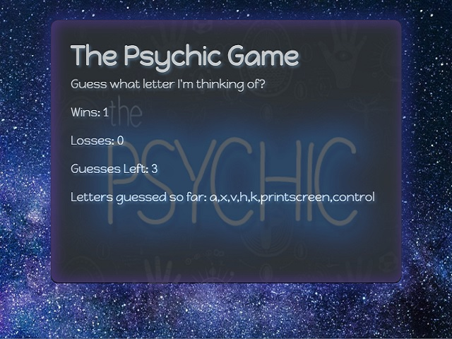

# Psychic Game

The __*Psychic Game*__  is a letter quessing game. 
Game Rules:
* The computer randomly selects an alphabet.
* The player presses letters on the keyboard to quess the letter that was selected by the computer.
* The player has 10 chances to pick the right letter.

---
### Technologies Used:
* Html
* CSS
* Javascript
* JQuery
* Bootstrap

---
###  Link:
https://jefferycarmichael.github.io/Psychic-Game/

### GiftHub:
https://github.com/JefferyCarmichael/Psychic-Game